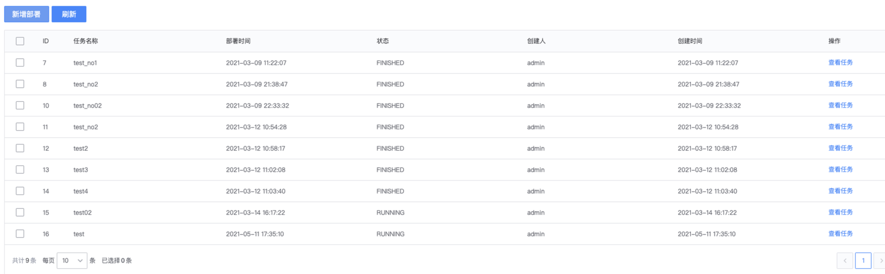
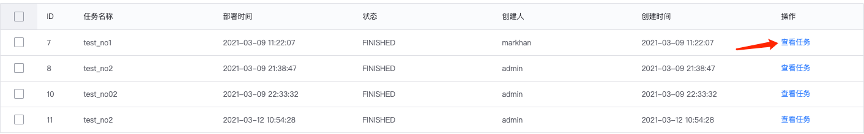

# SaaS 开发课程实战项目

## 项目介绍

本课程项目要求实现一个蓝鲸 SaaS 应用，具体要求支持以下功能

1. 该应用需要拉取标准运维的流程模板列表，用户可选择任意一个模板，通过SaaS填写对应参数创建并执行任务。任务执行记录存入该应用的数据库，前端需要展示任务执行记录。
2. 由于任务创建操作比较敏感，所以需要对用户的操作进行鉴权。需要将本应用接入权限中心，完成权限的管理。需要引入权限中心发布的IAM SDK，然后根据help文件夹《权限中心SDK使用说明》，完成权限模型的注册。
3. 需要实现 **任务查看**, **任务创建** 两个操作的用户鉴权。当无对应操作权限的时候，需要提供改操作申请权限链接并展示在页面，方便用户点击跳转权限中心申请对应权限。

## 项目图示

本项目所需要实现的SaaS应为分为前端和后台两部分

### 1. 前端
作为用户入口，提供给用户查看任务，新建任务页面
页面实现效果参考展示如下（仅供参考）：

### 2. 后台
1.	API模块：提供查询任务，创建/执行任务，业务拉取，标准运维模板拉取等接口
2.	权限模块：实现权限模型注册，操作鉴权等功能
3.	Celery模块：实现标准运维任务状态的同步

## 功能解析

### 1. 任务管理

应用需要拉取到标准运维流程模板并渲染任务参数表单（注意：不同模板需要的任务参数不相同）。填写参数后创建并执行标准运维任务；列表需要展示正在执行或已执行的任务。

1. 点击新建，通过配置平台提供的search_business接口获取到用户有权限的业务，并通过标准运维get_template_list接口拉取当前业务的流程模板列表。选择一个模板时，考生需要调用标准运维get_template_info接口获取模板的信息，并根据模板信息在页面显示该模板需要填写的参数。任务创建完成后，需要在应用数据库存储对应任务的执行的操作记录。
    可参考如下展示（仅供参考）
    

2. 任务列表，中间可能涉及到的状态变更
    - 调用获取任务列表接口时，实时更新任务状态
    - 通过Celery异步任务更新任务状态

3. 任务查看，点击 **查看任务** 出现侧弹框。点击侧弹框中的 **查看详情** 即可跳转到标准运维页面查看任务执行状态。
    可参考如下展示（仅供参考）：
    
    

    SaaS的列表页需展示字段：任务ID（对应SaaS存储的ID），任务名称、创建时间，部署时间、创建人、状态（需要支持分页）
    任务列表可参考如下展示（仅供参考）：
    

4. 如需调用外部系统接口，请参考[接口文档](help/API说明文档.md)

5. 标准运维任务状态流转如下图所示

    

### 2. 权限中心注册权限模型
基本要求：成功注册权限模型，可以在权限中心申请权限页面看到注册的权限内容，具体检查页面如下。（仅供参考）

### 3. 操作鉴权
1.	获取任务列表接口需要调用IAM SDK检查用户是否有本系统的任务查看权限，有任务查看权限的可以看到所有任务，否则只能看到自己创建的任务。
2.	点击创建任务按钮时，需要检测当前用户是否拥有任务创建权限，如果没有，则需要生成权限申请URL （注意该URL为后台动态生成），通过弹窗等方式提示用户，并允许用户点击该URL跳转到对应的权限申请页面
3.	任务创建接口需要调用 IAM SDK 检查用户是否有任务创建权限，如果没有则拒绝创建，并返回提示信息给用户
无权限跳转可参考如下展示（仅供参考）：
 

## Roadmap

本项目将结合我们的课程分为五个部分

### 【Part 1】SaaS 后台框架搭建

- 结合需求创建model模型
- 通过DRF提供restful接口，其中标准运维相关接口以mock的形式提供
- 以装饰器的方式mock权限相关代码
    
### 【Part 2】前端页面开发

- 使用 lesscode 完成任务列表页面
- 新增部署按钮，刷新按钮，查看任务按钮
- 新建部署弹框（下拉框，文本输入框）
- 事件绑定、计算属性、侦听器等
- 进阶完成 lesscode 暂时无法实现的功能
- 把所有接口对接至后台接口

### 【Part 3】APIGateway 接入

- 讲解APIGateway对应文档查询
- 把Part3中mock掉的标准运维接口，调整为Gateway调用

### 【Part 4】异步任务支持
- 把查询标准运维任务状态的功能，通过celery周期任务实现
- 完成任务的消息通知，通过celery异步执行

### 【Part 5】权限中心接入
- 注册本项目的权限模型到权限中心（任务创建，执行记录查看）
- 对后台提供的接口结合iam sdk进行鉴权

## Support

- [wiki](https://github.com/Tencent/bk-sops/wiki)

- [白皮书](http://docs.bk.tencent.com/product_white_paper/gcloud/)

- [蓝鲸论坛](https://bk.tencent.com/s-mart/community)

- [蓝鲸 DevOps 在线视频教程](https://cloud.tencent.com/developer/edu/major-100008)

- [蓝鲸社区版交流1群](https://jq.qq.com/?_wv=1027&k=5zk8F7G)

## BlueKing Community

- [BK-CMDB](https://github.com/Tencent/bk-cmdb)：蓝鲸配置平台（蓝鲸 CMDB）是一个面向资产及应用的企业级配置管理平台。

- [BK-CI](https://github.com/Tencent/bk-ci)：蓝鲸持续集成平台是一个开源的持续集成和持续交付系统，可以轻松将你的研发流程呈现到你面前。

- [BK-BCS](https://github.com/Tencent/bk-bcs)：蓝鲸容器管理平台是以容器技术为基础，为微服务业务提供编排管理的基础服务平台。

- [BK-BCS-SaaS](https://github.com/Tencent/bk-bcs-saas)：蓝鲸容器管理平台 SaaS 基于原生 Kubernetes 和 Mesos 自研的两种模式，提供给用户高度可扩展、灵活易用的容器产品服务。

- [BK-PaaS](https://github.com/Tencent/bk-paas)：蓝鲸 PaaS 平台是一个开放式的开发平台，让开发者可以方便快捷地创建、开发、部署和管理 SaaS 应用。

- [BK-SOPS](https://github.com/Tencent/bk-sops)：标准运维（SOPS）是通过可视化的图形界面进行任务流程编排和执行的系统，是蓝鲸体系中一款轻量级的调度编排类 SaaS 产品。

- [BK-JOB](https://github.com/Tencent/bk-job) 蓝鲸作业平台(Job)是一套运维脚本管理系统，具备海量任务并发处理能力。

## Contributing

如果你有好的意见或建议，欢迎给我们提 Issues 或 Pull Requests，为蓝鲸开源社区贡献力量。

## License

基于 MIT 协议， 详细请参考[LICENSE](LICENSE.txt)
