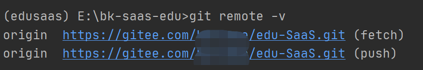
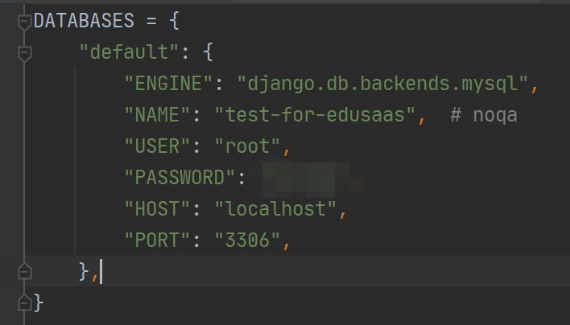
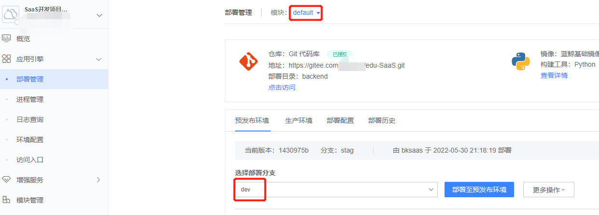

# 实战项目指南

# 开发环境配置(供参考)：

- ide：PyCharm 2020.2.3 (Professional Edition)

- Python：3.6.8

- Node：v14.17.6

- MySQL: 5.7

- git: 2.32.0.windows.2

# 开发准备

## 拉取项目

进入GitHub的实战项目界面，复制项目git地址


打开命令行终端拉取项目下来，

```
git clone git@github.com:TencentBlueKing/bk-saas-edu.git
```


执行完成后即可拉取项目到本地

 

## 使用 Pycharm 打开项目，配置项目目录


进入项目设置


配置项目结构


## 创建 Python 虚拟环境

继续打开项目设置，找到并点击Python Interpreter


点击OK即可基于 Python3.6 创建一个虚拟环境


## 下载依赖

点击Pycharm左下角的terminal，打开命令行终端


进入后端目录`cd backend`


- 下载bkapi-bk-sops

打开开发者中心 https://bkpaas.paas-edu.bktencent.com/ ，点击进入API文档


点击 bk-sops


如下图所示点击下载压缩包


在terminal中输入

```
pip install <包所在的路径>/bkapi-bk-sops-1.0.2.tar.gz
```

在terminal中输入`pip list | grep bkapi-bk-sops` 检查是否添加成功添加 bkapi-bk-sops 依赖


在命令行输入`pip install -r requirements.txt`，按回车执行完成后即可


# 创建SaaS应用

## gitee--创建仓库

打开 https://gitee.com/ ，（需注册）登录后新建仓库


创建完毕后复制仓库的 git 地址


## 链接gitee仓库

回到 Pycharm 的 terminal 终端，清空远程仓库地址并添加 gitee 仓库地址为远程仓库

```git
git remote remove origin
git remote add origin <项目仓库地址>
```

确定是否修改成功：`git remote -v`



## 推送到gitee仓库

在命令行中输入 `git push origin master`


刷新下gitee的项目界面，会发现已经成功把本地的仓库推送到gitee的仓库中了


## 开发者中心-创建蓝鲸SaaS应用

进入开发者中心 https://bkpaas.paas-edu.bktencent.com/ ，点击创建应用


输入应用信息与仓库信息


蓝鲸SaaS项目就创建成功啦！


### 创建新模块--用于部署前端服务

进入项目页面，点击新增模块


成功创建`frontend`模块


### 设置前端模块为主模块


# 本地启动

- 获取蓝鲸SaaS应用ID和TOKEN
  打开开发者中心 https://bkpaas.paas-edu.bktencent.com/ ， 进入创建的蓝鲸应用
  
  
  
  点击”基本设置“->”基本信息“
  
  
  
  如图所示，`bk_app_code` 为应用ID，而`bk_app_secret`为应用鉴权TOKEN，这两个变量在之后的环境变量配置会用到。

- 创建数据库
  
  打开命令行终端，输入下列指令进入MySQL：
  
  ```
  mysql -u root -p
  ```
  
  
  
  以应用ID为数据库名创建数据库，以上面的测试项目为例，应用ID为`saas-prac-guide`，则创建数据库语句为
  
  ```
  CREATE DATABASE `saas-prac-guide` default charset utf8 COLLATE utf8_general_ci;
  ```
  
  
  
  创建数据库成功

- 配置数据库
  打开Pycharm，在`bk-saas-edu/backend/`中新建`local_settings.py`
  
  在该文件中输入数据库配置：
  
  ```
  DATABASES = {
      "default": {
          "ENGINE": "django.db.backends.mysql",
          "NAME": APP_CODE,  # noqa
          "USER": "root",
          "PASSWORD": "",
          "HOST": "localhost",
          "PORT": "3306",
      },
  }
  ```
  
  `USER`和`PASSWORD`中分别输入本地MySQL的用户名和密码，`NAME`中输入应用ID`bk_app_code`的内容
  
  

- 修改iam迁移文件
  
  打开`backend/support-files/iam/0001_bk_saas_edu_20220321-1505.json`
  
  按`ctrl+r`搜索替换`bk-saas-edu-v3`和`bk-saas-edu`为自己的 appcode
  
  
  
  修改项目信息介绍，修改成自己项目的信息即可
  
  

- 数据库迁移
  
  
  如图进入配置页面，点击添加Python
  
  
  配置信息
  
  
  
  所需的环境变量如下
  
  ```
  PYTHONUNBUFFERED=1
  BK_PAAS2_INNER_URL=http://paas-edu.bktencent.com:80
  BK_PAAS2_URL=https://paas-edu.bktencent.com/
  DJANGO_SETTINGS_MODULE=settings
  BKPAAS_MAJOR_VERSION=3
  NODE_ENV=development
  BK_COMPONENT_API_URL=https://bkapi.paas-edu.bktencent.com
  BK_LOGIN_URL=http://paas-edu.bktencent.com:80/login/
  PIP_EXTRA_INDEX_URL=http://bkrepo.paas-edu.bktencent.com/pypi/bkpaas/pypi/simple
  BK_API_URL_TMPL=http://bkapi.paas-edu.bktencent.com/api/
  BKPAAS_APP_ID=<bk_app_code的内容>
  BKPAAS_APP_SECRET=<bk_app_secret的内容>
  ```
  
  
  
  点击运行
  
  
  
  
  
  

## 本地运行后端

- 修改本地host  

修改`C:/Windows/System32/drivers/etc/hosts`，添加

```
127.0.0.1 local.paas-edu.bktencent.com
```

- Django配置


配置环境变量内容与上面一样

- 本地运行Django
  
  
  
  
  
  
- 运行celery
配置celery worker和 celery beat

  
  
  
  
分别运行 celery worker和 celery beat

  
  
  

- 访问后端服务
  点击链接或访问`http://local.paas-edu.bktencent.com:5000/`可打开如下页面：
  
  

## 本地运行前端
  ```
  cd frontend
  npm install
  ```
  
  若想重新安装，请将`frontend`目录下的`package-lock.json`, `node_modules/`, `lib/client/.webpack_cache/` 删除后，重新执行上述命令

- 配置环境变量
  修改 `frontend/package.json`，
  
  - 填写`BKPAAS_APP_ID` 和 `APP_CODE`，内容为创建的应用`bk_app_code`
  
  - 填写`BKPAAS_APP_SECRET`，内容为应用`bk_app_secret`
  
  

- 本地启动前端服务
  
  ```
  npm run dev
  ```
  
  
  
  点击链接或访问`http://local.paas-edu.bktencent.com:8000/`可打开如下页面：
  
  
  
  若想调用本地接口需要在本地把后端服务也启动起来，启动后通过操作前端界面即可调用后端接口。
  
  

# 部署SaaS

## 配置app_desc.yaml

修改根目录下的`app_desc.yaml`，修改`bk_app_code`配置


## 仓库分支管理

- master分支---用于发布生产环境

- dev分支---开发分支，不做内容限制

- stag分支---用于发布预发布环境

## 创建stag和dev分支

- 打开git项目仓库，进入分支管理页面


新建分支，分别创建stag和dev分支


## 推送配置修改到个人仓库的开发分支

把 `backend/support-files/iam/0001_bk_saas_edu_20220321-1505.json`和`app_desc.yaml`的修改推送到自己的git仓库里

- 创建并切换到dev分支

```
git checkout -b dev
```

- 保存修改

```
git add app_desc.yaml
cd backend
git add support-files/iam/0001_bk_saas_edu_20220321-1505.json
git commit -m "feat(deploy): 修改iam项目配置和app_desc配置"
```


- 推送修改

```
git push origin dev
```


## 部署预发布环境

- 新建Pull Request


- 合入代码到stag分支


- 部署预发布环境--后端服务

进入开发者中心项目概览，切换模块至`default`模块


进入部署界面，点击部署




- 部署预发布环境--前端服务

切换至frontend模块


点击部署


## 部署生产环境

### 提交Pull Request到master


### 补充项目信息

进入开发者中心项目部署界面，点击“生产环境”


- 填写缺少的信息


### 部署生产环境--后端服务

切换至`default`模块，点击生产环境，分支选择`master`，


### 部署生产环境--前端服务


### 访问应用


